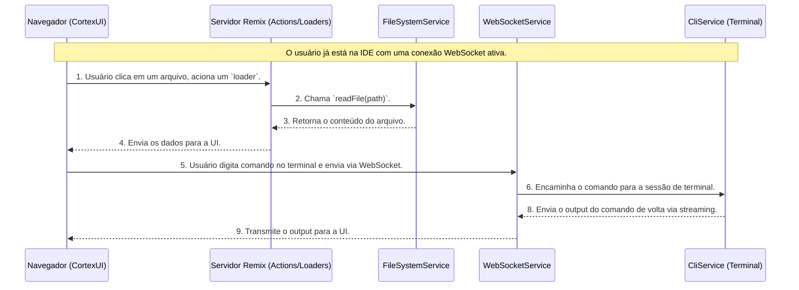

# Cortex Fullstack Architecture Document

| Date       | Version | Description                       | Autor               |
| :--------- | :------ | :-------------------------------- | :------------------ |
| 2025-07-21 | 1.0     | Documento inicial de arquitetura. | Winston (Arquiteto) |

## Introduction

Este documento delineia a arquitetura full-stack completa para o projeto **Cortex**. Ele servirá como a única fonte da verdade para o desenvolvimento guiado por IA, garantindo consistência em toda a stack de tecnologia. A abordagem unificada é ideal para a natureza integrada e monolítica do projeto, conforme especificado nos seus requisitos.

### Starter Template or Existing Project

Este é um projeto greenfield. A decisão foi utilizar o **template oficial do Remix** como base para acelerar o desenvolvimento e garantir a adesão às melhores práticas do framework.

---

## High Level Architecture

### Technical Summary

A arquitetura do Cortex será um **monolito full-stack coeso**, contido em um **monorepo** para simplificar o desenvolvimento e o deploy. Utilizaremos o **Remix** para gerenciar tanto o frontend quanto o backend em uma única aplicação Node.js. O backend terá acesso direto ao sistema de arquivos do servidor para executar as operações de workspace, terminal e a integração com CLIs externas (como Claude Code e Git). A interface do usuário (UI) será renderizada no servidor (SSR) para máxima performance, seguindo uma abordagem **mobile-first** com Tailwind CSS e shadcn/ui. Toda a solução será empacotada com **Docker** para garantir a portabilidade e o requisito de ser **auto-hospedável (self-hostable)**.

### Platform and Infrastructure

Considerando o requisito fundamental de ser auto-hospedável (`self-hostable`), a melhor abordagem é utilizar **Docker**.

- **Plataforma:** Servidor Linux com Docker.
- **Serviços Chave:**
  - **Aplicação Cortex:** Um único contêiner Docker contendo a aplicação Remix.
  - **Proxy Reverso:** Um contêiner com Nginx ou Caddy para gerenciar o tráfego de entrada e certificados SSL.
- **Hospedagem de Deploy:** Qualquer provedor de VPS (ex: DigitalOcean, Vultr, AWS EC2) ou servidor on-premise.

### Repository Structure

Conforme definido no PRD, utilizaremos um **Monorepo**.

- **Estrutura:** Monorepo.
- **Gerenciamento:** `npm workspaces`.
- **Organização dos Pacotes:**
  - `apps/cortex-web`: A aplicação principal do Remix.
  - `packages/ui`: Componentes React compartilhados.
  - `packages/shared-types`: Interfaces TypeScript compartilhadas.

### High Level Architecture Diagram

Este diagrama ilustra a interação entre os principais componentes do sistema.

```mermaid
graph TD
    subgraph "Usuário"
        A[Developer]
    end

    subgraph "Infraestrutura do Servidor"
        C[Proxy Reverso<br/>(Nginx)]

        subgraph Cortex Docker Container
            D[Servidor Remix<br/>(Backend & Frontend Logic)]
            E[Banco de Dados<br/>(SQLite via Prisma)]
            F[Sistema de Arquivos<br/>(Workspaces do Usuário)]
            G[Processos Externos<br/>(Git, Claude Code, Terminal)]
        end
    end

    A --> B[Navegador Web];
    B --> C;
    C --> D;
    D <--> E;
    D <--> F;
    D <--> G;

```

### Architectural and Design Patterns

- **Aplicação Full-Stack Monolítica:** O frontend e o backend coexistirão na mesma base de código Remix.
- **Arquitetura Baseada em Componentes (Frontend):** A UI será construída com componentes reutilizáveis e bem definidos.
- **Camada de Serviço (Backend):** A lógica de negócio complexa será abstraída em "serviços" (módulos TypeScript).
- **Padrão de Repositório (Backend):** O acesso ao banco de dados será abstraído usando o Prisma.
- **Execução de Processos Externos (`Child Process`):** A interação com ferramentas CLI será feita através do módulo `child_process` do Node.js.

---

## Tech Stack

Esta tabela representa as decisões tecnológicas definitivas para o projeto Cortex.

| Categoria                | Tecnologia   | Versão (Inicial)       | Propósito                                             | Racional                                                                              |
| :----------------------- | :----------- | :--------------------- | :---------------------------------------------------- | :------------------------------------------------------------------------------------ |
| **Linguagem**            | TypeScript   | **5.8**                | Linguagem principal para todo o projeto.              | Padrão de mercado para desenvolvimento robusto com Remix; segurança de tipos.         |
| **Runtime**              | Node.js      | **22.x**               | Ambiente de execução do servidor.                     | Requisito explícito do projeto; ecossistema maduro.                                   |
| **Framework Full-stack** | Remix        | **2.16.8**             | Framework principal para UI e lógica de servidor.     | Requisito explícito para um monolito coeso e SSR.                                     |
| **Banco de Dados**       | SQLite       | `~5.x`                 | Persistência de dados (usuários, workspaces).         | Requisito explícito para portabilidade na versão inicial.                             |
| **ORM**                  | Prisma       | **6.x**                | Camada de acesso e migração do banco de dados.        | Definido na Estória 1.3; simplifica as operações de DB.                               |
| **Estilização**          | Tailwind CSS | **4.1.11**             | Framework de estilização utilitário.                  | Sua preferência; integra perfeitamente com shadcn/ui.                                 |
| **Componentes de UI**    | shadcn/ui    | `Mais recente estável` | Biblioteca de componentes acessíveis e customizáveis. | Escolha da especificação de UI/UX para agilidade.                                     |
| **Ícones**               | Lucide Icons | `Mais recente estável` | Biblioteca de ícones.                                 | Definido na especificação de UI/UX.                                                   |
| **Testes (Unit/Int)**    | Vitest       | `~1.x`                 | Framework para testes de unidade e integração.        | Moderno, rápido e com excelente integração com o ecossistema Vite (usado pelo Remix). |
| **Testes (E2E)**         | Playwright   | `~1.x`                 | Framework para testes end-to-end.                     | Robusto para testar aplicações web complexas e fluxos de usuário.                     |
| **Linting**              | ESLint       | `~8.x`                 | Análise estática de código para qualidade.            | Definido na Estória 1.2.                                                              |
| **Formatação**           | Prettier     | `~3.x`                 | Formatador de código.                                 | Definido na Estória 1.2.                                                              |
| **Containerização**      | Docker       | `Mais recente estável` | Empacotamento da aplicação para portabilidade.        | Melhor abordagem para cumprir o requisito de ser `self-hostable`.                     |
| **Terminal (Backend)**   | node-pty     | `~1.x`                 | Pseudoterminal para sessões interativas de terminal.  | **[IMPLEMENTADO]** Necessário para terminal funcional em ambiente Linux.              |
| **Terminal (Frontend)**  | @xterm/xterm | `~5.x`                 | Emulador de terminal web para interface do usuário.   | **[IMPLEMENTADO]** Biblioteca padrão para terminais web interativos.                  |
| **WebSockets**           | ws           | `~8.x`                 | Biblioteca WebSocket para comunicação real-time.      | **[IMPLEMENTADO]** Para streaming de I/O do terminal e comunicação bidirecional.      |

---

## Data Models (Revised)

A persistência de dados será dividida: o banco de dados para autenticação e arquivos de configuração YAML para as definições de ambiente.

### 1\. In the Database (Managed by Prisma)

**User**
Este será o **único** modelo no nosso banco de dados SQLite.

- **Purpose:** Manage accounts and access credentials for the Cortex platform.
- **TypeScript Interface:**
  ```typescript
  export interface User {
    id: string;
    email: string;
    createdAt: Date;
    updatedAt: Date;
  }
  ```

### 2\. In Configuration Files (Managed by File Services)

**a) `workspaces.yaml` (Global Configuration File)**

- **Purpose:** List all workspaces (projects) that have been added to the IDE.
- **Location:** `/<cortex_root>/config/workspaces.yaml`.
- **File Structure:**
  ```yaml
  workspaces:
    - name: "API de Pagamentos"
      path: "/home/user/dev/payment-api"
    - name: "Website Institucional"
      path: "/home/user/dev/corp-website"
  ```
- **Corresponding TypeScript Interface:**
  ```typescript
  export interface Workspace {
    name: string;
    path: string;
  }
  ```

**b) `cortex.yaml` (Per-Workspace Configuration File)**

- **Purpose:** Store `SavedCommands` and `Workflows` specific to that project.
- **Location:** `/<workspace_path>/cortex.yaml`.
- **File Structure:**

  ```yaml
  savedCommands:
    - name: "Rodar testes de unidade"
      command: "npm run test:unit"

  workflows:
    - name: "Analisar e Refatorar Componente"
      steps:
        - name: "Explicar o código"
          command: "claude-code --explain ./src/components/Button.tsx"
  ```

- **Corresponding TypeScript Interfaces:**

  ```typescript
  export interface SavedCommand {
    name: string;
    command: string;
  }

  export interface WorkflowStep {
    name: string;
    command: string;
  }

  export interface Workflow {
    name: string;
    steps: WorkflowStep[];
  }
  
  // Terminal Session Models - [IMPLEMENTADO]
  export interface TerminalSession {
    id: string;
    workspaceName: string;
    workspacePath: string;
    userId: string;
    pid?: number;
    status: 'active' | 'inactive' | 'terminated';
    createdAt: Date;
  }

  export interface TerminalMessage {
    type: 'input' | 'output' | 'error' | 'exit';
    data: string;
    sessionId: string;
  }
  ```

---

## API Specification

A "API" do Cortex é definida pelas funções `loaders` (leitura) e `actions` (escrita) do Remix, com o contrato garantido pelo TypeScript.

### Conceptual "Endpoints" (Loaders and Actions)

- **Authentication:** `action` for `/setup`, `/login`, `/logout`.
- **Workspaces:** `loader` to list workspaces from `workspaces.yaml`, `action` to add/remove them.
- **Workspace Files:** `loader` to read file trees and content, `action` to save file content.
- **Workspace Settings:** `loader` and `action` to read/write the `cortex.yaml` file.

### Real-time Communication (WebSockets)

Para funcionalidades interativas como o **Terminal** e o **monitoramento de Tarefas**, usaremos WebSockets para comunicação contínua entre o cliente e o servidor.

#### Terminal WebSocket Implementation
- **Endpoint:** `/ws/terminal` para comunicação real-time
- **Protocolo:** WebSocket com mensagens tipadas para input/output/error/exit
- **Servidor:** WebSocket server rodando na porta 8000 (desenvolvimento)
- **Backend:** `node-pty` para pseudoterminal adequado em ambiente Linux

---

## System Components

### Backend Services
- **`AuthService` (Backend):** Manages user logic and interacts with Prisma.
- **`ConfigService` (Backend):** Reads and writes YAML configuration files.
- **`FileSystemService` (Backend):** Interacts with the server's file system for workspace files.
- **`CliService` (Backend):** Manages the execution of external command-line tools.
- **`TerminalService` (Backend):** **[IMPLEMENTADO]** Manages interactive terminal sessions using node-pty with workspace path validation and security boundaries.
- **`WebSocketService` (Backend):** **[IMPLEMENTADO]** Manages real-time communication for terminal I/O streaming.

### Frontend Components
- **`CortexUI` (Frontend):** The main React application rendered by Remix.
- **`Terminal` (Frontend):** **[IMPLEMENTADO]** Interactive web terminal component using @xterm/xterm with WebSocket communication for real-time command execution.

---

## External APIs

O MVP do Cortex não consome diretamente nenhuma API HTTP externa. A integração é feita com ferramentas de linha de comando (CLIs) locais no servidor.

---

## Core Workflows

O diagrama abaixo detalha o fluxo técnico para o loop principal de codificação.



---

## Database Schema

O arquivo `prisma/schema.prisma` conterá apenas o modelo `User`.

```prisma
datasource db {
  provider = "sqlite"
  url      = env("DATABASE_URL")
}

generator client {
  provider = "prisma-client-js"
}

model User {
  id        String   @id @default(cuid())
  email     String   @unique
  password  String
  createdAt DateTime @default(now())
  updatedAt DateTime @updatedAt
}
```

---

## Source Tree

```plaintext
cortex/
├── apps/
│   └── web/
│       ├── app/
│       │   ├── components/    # Componentes React
│       │   │   └── Terminal.tsx # [IMPLEMENTADO] Terminal web interativo
│       │   ├── lib/           # Utilitários, cliente Prisma  
│       │   │   └── websocket-server.ts # [IMPLEMENTADO] Servidor WebSocket
│       │   ├── routes/        # Rotas, Loaders, Actions
│       │   │   └── api.terminal-port.ts # [IMPLEMENTADO] API endpoint para porta do terminal
│       │   ├── services/      # Lógica de negócio do Backend
│       │   │   └── terminal.service.ts # [IMPLEMENTADO] Gerenciamento de sessões de terminal
│       │   └── styles/        # CSS Global, Tailwind
│       ├── prisma/
│       └── ...
├── config/
│   └── workspaces.yaml
├── packages/
│   ├── shared-types/    # Interfaces TypeScript (User, Workspace, etc.)
│   └── ui/              # Componentes de UI reutilizáveis
├── .env.example
├── Dockerfile
├── docker-compose.yml
└── package.json         # Raiz do Monorepo com workspaces
```

---

## Story 3.6 Implementation: Interactive Web Terminal

### Visão Geral da Implementação
A Story 3.6 implementou com sucesso um terminal web interativo completamente funcional no painel inferior da IDE, com comunicação real-time via WebSockets e sessões de terminal seguras delimitadas por workspace.

### Componentes Críticos Implementados

#### Frontend - Terminal Component
- **Localização:** `apps/web/app/components/Terminal.tsx`
- **Tecnologia:** @xterm/xterm com addons (fit, web-links)
- **Funcionalidades:**
  - Emulador de terminal com tema escuro consistente com a IDE
  - Redimensionamento automático no painel
  - Comunicação WebSocket em tempo real
  - Tratamento de erro com reconexão inteligente
  - Imports dinâmicos para compatibilidade SSR

#### Backend - Terminal Service
- **Localização:** `apps/web/app/services/terminal.service.ts`
- **Tecnologia:** node-pty para pseudoterminal real
- **Funcionalidades:**
  - Criação de sessões de terminal delimitadas por workspace
  - Validação de segurança de path para prevenir escape do workspace
  - Gerenciamento de processo com cleanup adequado
  - Suporte a redimensionamento de terminal

#### WebSocket Server
- **Localização:** `apps/web/app/lib/websocket-server.ts`
- **Configuração:** Porta 8000 (desenvolvimento)
- **Funcionalidades:**
  - Servidor WebSocket singleton para prevenir conflitos de porta
  - Streaming de I/O bidirecional
  - Gerenciamento de múltiplas sessões simultâneas
  - Implementação de protocolo de mensagens tipadas

### Learnings e Resoluções Críticas

#### Bug Fixes Importantes
1. **SSR Compatibility:** Implementação de imports dinâmicos para xterm.js evitar problemas de renderização server-side
2. **Infinite Loop Prevention:** Uso de useRef para sessionId estável e prevenção de loops de re-renderização
3. **PTY vs Child Process:** Migração de `child_process.spawn` para `node-pty` para terminal interativo adequado
4. **Port Conflicts:** Configuração de portas fixas (8000 WebSocket, 8080 web) com padrão singleton

#### Segurança e Validação
- Validação rigorosa de paths de workspace para prevenir directory traversal
- Isolamento de processos dentro dos limites do workspace
- Autenticação de sessão via SessionService
- Cleanup adequado de processos para prevenir zombies

### Integração com Arquitetura Existente
- **IDELayout:** Terminal integrado no painel inferior com redimensionamento
- **Workspace System:** Sessões iniciadas no diretório correto do workspace
- **Security Patterns:** Reutilização dos padrões de segurança estabelecidos no FileSystemService

---

## Infrastructure and Deploy (Revised with Manual Deploy)

### Infrastructure as Code (IaC)

- **Tool:** Docker and Docker Compose.
- **Approach:** A `Dockerfile` with multi-stage builds for optimized production images and a `docker-compose.yml` for local development.

### Deployment Strategy (Manual)

The deployment will be a manual process:

1.  **Build Image:** Build the production Docker image locally.
2.  **Publish Image:** Push the image to a container registry.
3.  **Access Server:** SSH into the target server.
4.  **Update:** Pull the new image and restart the service using Docker Compose.

### Environments

- **Development (Local):** Run via `docker-compose up`.
- **Staging:** A server for pre-production testing.
- **Production:** The live server for users.

### Rollback Strategy (Manual)

- Rollback consists of manually re-deploying the previous stable image tag from the container registry.

---

## Error Handling Strategy

- **Approach:** Use custom error classes (`ValidationError`, `AuthenticationError`). Detailed server-side errors will be logged, and safe, generic error messages will be sent to the client.
- **Backend:** Logic in `actions/loaders` will be wrapped in `try...catch` blocks.
- **Frontend:** Use React Error Boundaries for rendering errors and display "toasts" for API errors.
- **Logging:** Use a structured JSON logger like `Pino` on the backend, avoiding any sensitive data.

---

## Coding Standards

These are mandatory rules for AI agent implementation.

### Core Standards

- **Language/Runtime:** TypeScript `5.8`, Node.js `22.x`.
- **Style/Linting:** ESLint and Prettier configured at the monorepo root.
- **Test Files:** Use the `*.test.tsx` or `*.test.ts` naming convention.

### Critical Rules

1.  **Shared Types:** All shared types must be defined in and imported from `packages/shared-types`.
2.  **Service Layer:** All backend business logic must be in the `apps/web/app/services/` directory. `loaders` and `actions` should only call these services.
3.  **Environment Variables:** Access environment variables only through a central, typed config module.
4.  **File System:** All file system interactions must go through the `FileSystemService`.
5.  **Error Handling:** Use custom error classes when throwing exceptions in services.

### Naming Conventions

| Element          | Convention               | Example           |
| :--------------- | :----------------------- | :---------------- |
| React Components | `PascalCase`             | `FileBrowser.tsx` |
| React Hooks      | `camelCase` (use prefix) | `useWorkspace.ts` |
| Backend Services | `camelCase`              | `authService.ts`  |

---

## Test Strategy

### Philosophy

- **MVP Focus:** A robust suite of unit and integration tests.
- **E2E (Post-MVP):** End-to-end tests will be added after the MVP is stable.
- **Coverage:** Aim for \>80% coverage on critical business logic.

### Test Types and Tools

1.  **Unit Tests (`Vitest`):** For isolated testing of services, components, and utility functions.
2.  **Integration Tests (`Vitest`):** For testing the full flow of Remix routes (`loader`/`action` -\> service -\> test database).

### Test Data Management

- A Prisma seed script will be used to populate a test database, ensuring consistent test runs.
