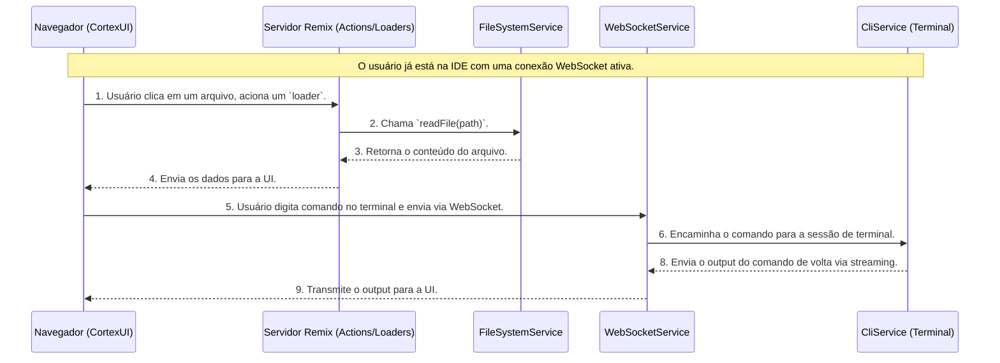

# Core Workflows

O diagrama abaixo detalha o fluxo técnico para o loop principal de codificação.

```mermaid
sequenceDiagram
    participant Navegador (CortexUI)
    participant Servidor Remix (Actions/Loaders)
    participant FileSystemService
    participant WebSocketService
    participant CliService (Terminal)

    Note over Navegador (CortexUI), CliService (Terminal): O usuário já está na IDE com uma conexão WebSocket ativa.

    Navegador (CortexUI)->>Servidor Remix (Actions/Loaders): 1. Usuário clica em um arquivo, aciona um `loader`.
    Servidor Remix (Actions/Loaders)->>FileSystemService: 2. Chama `readFile(path)`.
    FileSystemService-->>Servidor Remix (Actions/Loaders): 3. Retorna o conteúdo do arquivo.
    Servidor Remix (Actions/Loaders)-->>Navegador (CortexUI): 4. Envia os dados para a UI.

    Navegador (CortexUI)->>WebSocketService: 5. Usuário digita comando no terminal e envia via WebSocket.
    WebSocketService->>CliService (Terminal): 6. Encaminha o comando para a sessão de terminal.
    CliService (Terminal)-->>WebSocketService: 8. Envia o output do comando de volta via streaming.
    WebSocketService-->>Navegador (CortexUI): 9. Transmite o output para a UI.
```

---
